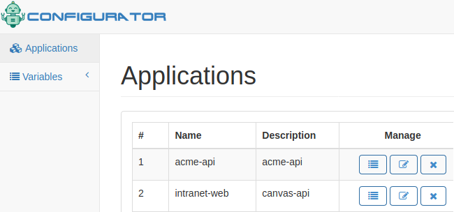

# CONFIG-NET

Centralize and Management configurations of all your applications.


# Requirements

- Mysql database. You could use docker : https://gist.github.com/jrichardsz/73142c5c7eb7136d80b165e75d3a1e22
- Execute ddl in your mysql database: ./database/ddl.sql
- Node.js > 8.*

# Getting Started

## Environment variables:

```
export PORT=8080
export CONFIGNET_DATABASE_HOST=localhost
export CONFIGNET_DATABASE_USER=root
export CONFIGNET_DATABASE_PASSWORD=secret
export CONFIGNET_DATABASE_PORT=3306
export CONFIGNET_DATABASE_NAME=confignet
export API_KEY=changeme
```

## As developer

```
npm install
npm run dev
```

## As production

```
npm install
npm run start
```

# Usage

Open your browser pointing at:

- http://localhost:8080

> Note: Admin password will be showed in the server log.

If no errors, you will see:



# Users

By default two user are created:

- admin with admin role
- guest with reader role

Password are printed in the first log. Take care to delete them of the log!

Admin can make anything. Guest user only can enter to few options and can't view secrets values.


# Get variables

```
curl localhost:8080/api/v1/variables?application=helicarrier-api -H "apiKey:changeme"
```

response will be

```
export ERP_HOST="12.124.1.6"
export firebase_key="65468748"
```

If **helicarrier-api** exists as application and has at least one variable

# Roadmap

- [ ] add http endpoint to get variables in environment or json format
- [ ] improve user experience in **Add Global Variable** ui
- [ ] add changelog column for each app or variable
- [ ] add feature to create : read only users
- [ ] add feature to create users to consume specific apps: /api/variables
- [ ] add easy import/export feature
- [ ] add dependency injection
- [ ] unit tests/selenium tests


# Made with

- Node.js
- Mysql
- Web template engine for fast development: https://www.npmjs.com/package/pug
- Bootstrap template: https://adminlte.io/
- Handlebars Engine : https://handlebarsjs.com/builtin_helpers.html
- Initial template : https://github.com/jayetan/Nodejs-Admin-Dashboard.git


# Contributors

Thanks goes to these wonderful people :

<table>
  <tbody>
    <td>
      
      <br />
      <label><a href="http://jrichardsz.github.io/">Richard Leon</a></label>
      <br />
    </td>    
  </tbody>
</table>
