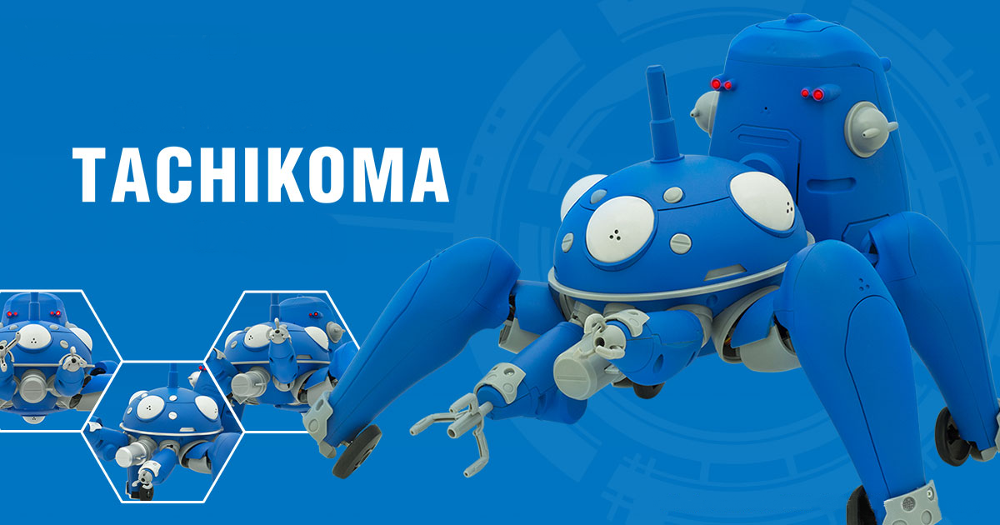
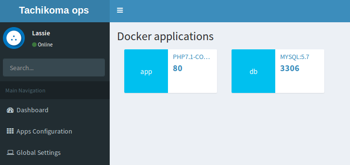

# TACHIKOMA OPS

- Do you want something like heroku but on premise and with full control?
- Do you need centralize your applications configurations?
- Do you need deploy your applications in an easy way?

If you have these questions, Tachikoma ops is for you!!



# Requirements

- Mysql database

```
docker run -d -p 3306:3306 --name database -e MYSQL_ROOT_PASSWORD=secret mysql:5.7 --character-set-server=utf8mb4 --collation-server=utf8mb4_unicode_ci
```

- Node.js > 8.*
- [Enable Docker Remote REST API on Docker Host](http://www.littlebigextra.com/how-to-enable-remote-rest-api-on-docker-host/)

# Getting Started

## Environment variables:

- export DOCKERD_API_REST_BASE_URL=http://localhost:1234
- export TACHIKOMA_DB_HOST=localhost
- export TACHIKOMA_DB_USER=root
- export TACHIKOMA_DB_PASSWORD=changeme
- export TACHIKOMA_DB_PORT=3306
- export TACHIKOMA_DB_NAME=tachikoma
- export PORT=6666

## As developer

```
npm install
npm run dev
```

## As production

```
npm install
npm run start
```

# Usage

Open your browser pointing at:

- http://localhost:6666

If no errors, you will see:



Listing your docker container

# Coming soon

- Code refactor
- unit tests
- create environment var using UI
- restart container at environment modifications
- build docker images
- start docker images

# Made with

- Node.js
- Web template engine for fast development: https://www.npmjs.com/package/pug
- Docker
- Bootstrap template: https://adminlte.io/

# Acknowledgments

- Logo from : https://tachikoma.cerevo.com
- Initial template : https://seegatesite.com/tutorial-create-crud-with-mysql-node-js-express-adminlte-for-beginner
